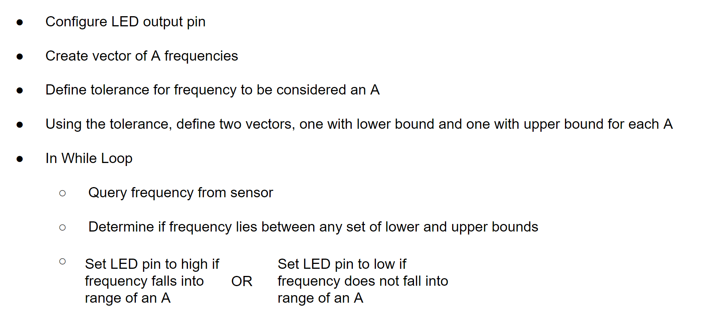

## Setup/Task 1
I downloaded Arduino IDE and I downloaded the Apollo 3 Arduino package, 

## Task 2
I used Arduino example code to make the LED on the Artemis nano blink. The code set the LED pin to output in its setup section. It then changed the value between high and low every second. When high, current passed through the LED, causing it to light up. The LED off and on is pictured below. 

 

## Task 3
I used the Arduino example Example2_Serial to print anything I typed into the Serial Monitor. I typed “Hello World” into the “send message line” and it appeared on the serial monitor after I hit enter. My Baud rate needed to be set to 115200 (as specified in the example program). The typed and printed message are pictured below.

 

## Task 4
I used the Arduino example Example4_analogRead to print out readings from sensors on the board. All sensor readings (including the temperature sensor) were printed to the serial monitor. When the board was exposed to the ambient room temperature, the temperature sensor read roughly 32700 (left values). When I blew hot air onto the board, the temperature sensor read roughly 33500 (right values). The temperature readings are ADC values of the interanl die temperature. 

 *                      * 

## Task 5
I used the Arduino example Example1_MicrophoneOutput to print out the highest frequency that the board was registering at that time. When the board was exposed to ambient noise in the lab. The highest frequency at any time was seemingly random (left values). However, when I whistled near the board, the highest frequency was consistent over time (right values). 

 *                      * 

## 5000 task 
To make a file that lights up the Artemis LED when an A frequency is detected, I mainly used existing code from both Example1_MicrophoneOutput and Blink. The only code that I added is described below in the psuedo code diagram. 

The code is run in the video below. At each octive, an A#, an A, and an A♭ are played to show if the code can distinguish an A from tones directly preceeding and succeeding it. The code performs well at high frequencies. However, it confuses an A♭ for an A at lower tones.

[A Detector Video]([Lab1/lab1Writeup.html](https://www.youtube.com/watch?v=F1Si5nIXZrc))
