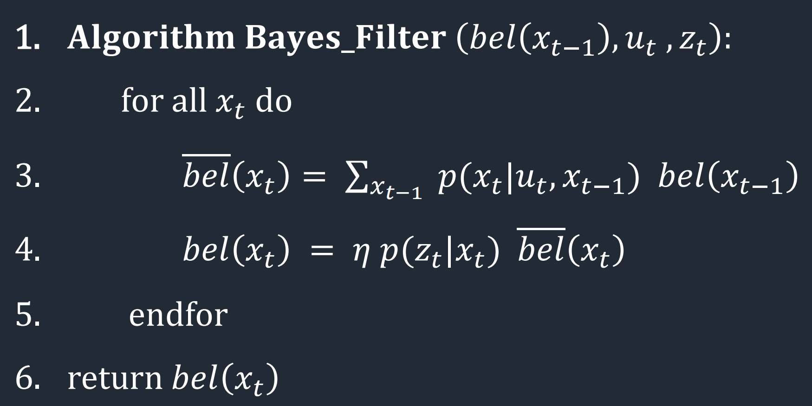
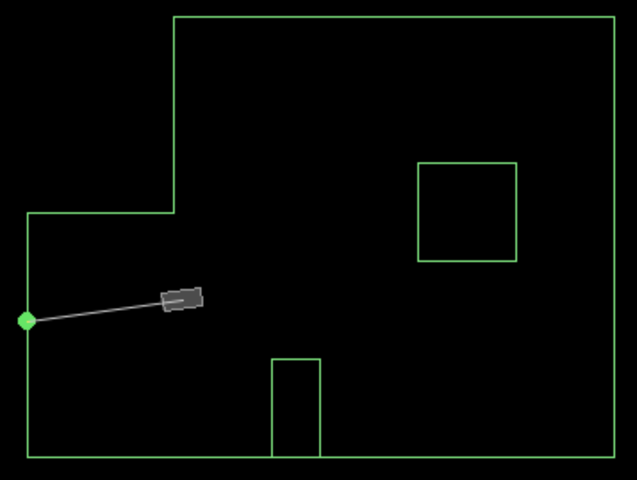
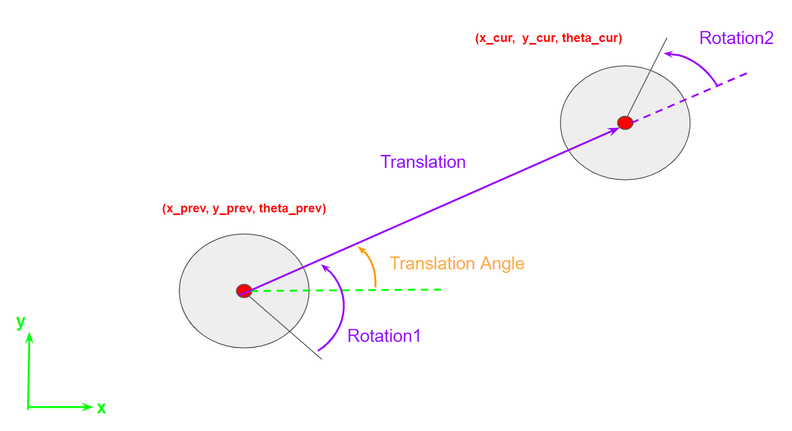
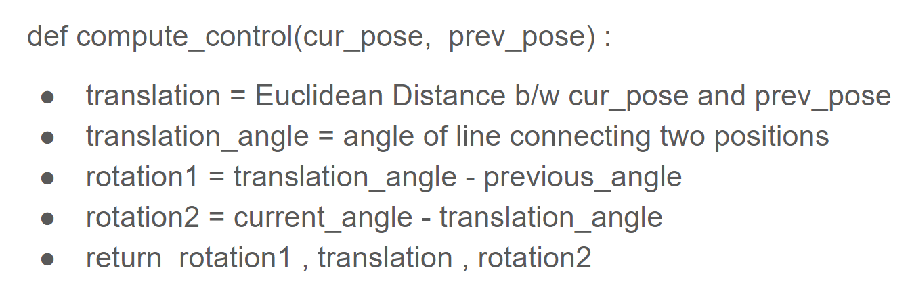

# Lab 10 Overview

In lab 10, students implemented a Bayes filter to localize a robot in a simulator as it moves around a map. The filter was informed by odometry and a depth sensor. Poses within the map were discretized for analysis.  

## Bayes Filter
The Bayes filter is comprised of two steps, a prediciton step (1) and an update step (2). The math for the two steps is shown below. 

## Prediction
The prediction step determines the probability of each pose based upon odometry and the previous belief. The probability of the ith pose is a sum of terms, one for every previous pose. For every previous pose j, the jth term in the sum is equal to the probability of the jth pose times the likelyhood that the robot reached the ith current pose from the jth previous pose. After the update step, all belief bar terms are normalized to sum to one.

## Update
The updated belief in each position k is the product of the belief bar of pose k and the likelyhood of the current sensor measurments given the predicted pose. To find the second probability in the product, current sensor measurments are compared with expected sensor measurments, which are calculated using the inverse sensor model. 

## Simulator Overview 
The simulator (picture below) allowed the user to manually steer the robot or create a predefined path. As the robot moved around the map, the Bayes filter estimated the pose. 

# Code
Students were provided with code to interact with data output by the simulator, namely odometry and sensors. Students were also provided a code skeleton in which to implement different parts of the Bayes filter. The code skeleton called functions which students completed.

## compute_control
The first funntion was compute control, which took two robot positions as input and output odometry data. The odometry data had 3 terms: rotation 1, translation, and rotation2. The three terms are defined as in the diagram below. Pseudo code for the function is also shown below. 

 

## odom_motion_model
The second function, odom_motion_model, took two positions and a control as input. The code output the probability that the robot started at one positions and ended at the other given the control. The form of the control was the same as that in compute control: rotation 1, translation, and rotation2.

