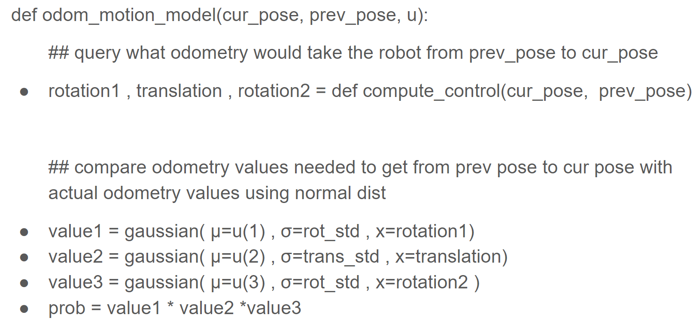
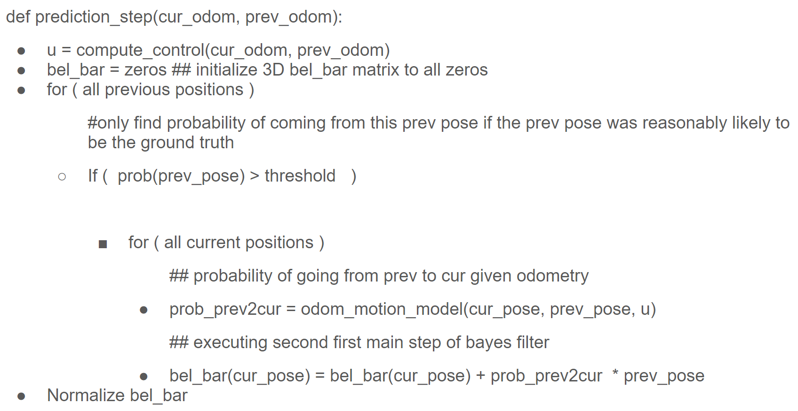
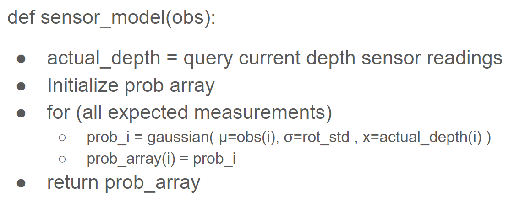
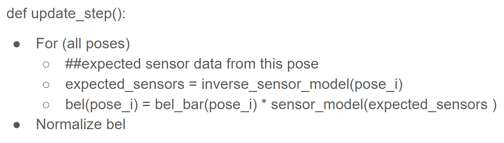
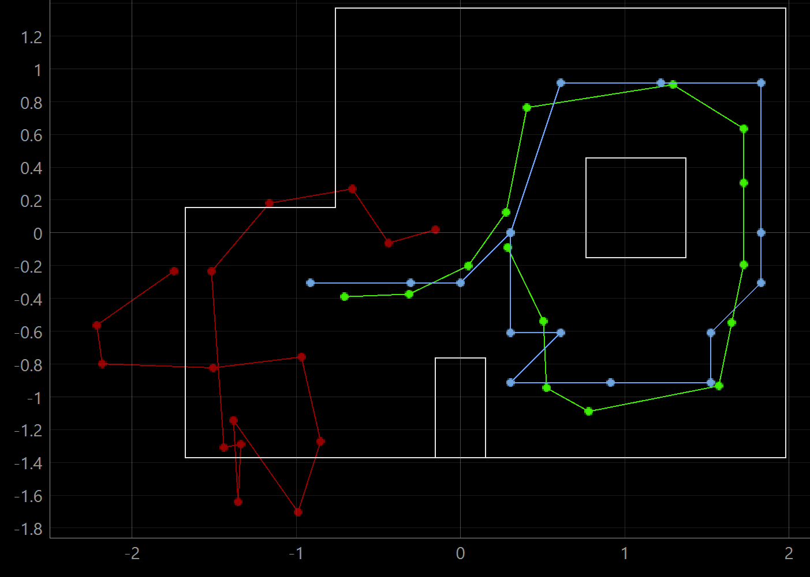

# Lab 10 Overview

In lab 10, students implemented a Bayes filter to localize a robot in a simulator. The filter was informed by odometry and a depth sensor. Poses within the map were discretized for analysis.  

## Bayes Filter
The Bayes filter consists of two steps, a prediction step (3) and an update step (4). The math for the two steps is shown below in the lecture slide. 

## Prediction
The prediction step determines the probability of each pose based upon odometry and the previous belief. The probability of the ith pose is a sum of terms, one for every previous pose. For every previous pose j, the jth term in the sum is equal to the probability of the jth pose (P(xt-1)) times the likelihood that the robot reached the ith current pose from the jth previous pose ( P(xt| xt-1, u) ). After the update step, all belief bar terms are normalized to sum to one.

## Update
The updated belief of each position k is the product of the belief bar of pose k and the likelihood of the current sensor measurements given the predicted pose. To find the probability of z given z_bar, the sensors are assumed to return values from a normal distribution, so the likelihood of z is determined by how far away it is from z_bar and the standard deviation of the distribution.

## Simulator Overview 
The simulator (picture below) allowed the user to manually steer the robot or create a predefined path. As the robot moved around the map, the Bayes filter estimated the pose. 

# Code Overview
Students were provided with code to interact with data output by the simulator, namely odometry and sensors. Students were also provided a code skeleton in which to implement different parts of the Bayes filter. The code skeleton called functions which students completed.

## compute_control
The first function was compute control, which took two robot positions as input and output odometry. The odometry had 3 terms: rotation1, translation, and rotation2. The three terms are defined in the diagram below. Pseudo code for the function is also shown below. 

 

## odom_motion_model
The second function, odom_motion_model, took in two positions and a control. The code output the probability that the robot started at one position and ended at the other given the control. The form of the control was the same as in compute control: rotation1, translation, and rotation2.

## prediction_step
The third function was prediction_step, which defined bel_bar. The function had six nested for loops in total: the outer three loops iterated through all previous positions. The inner three loops iterated through all current positions. For each set of previous and current positions, the function found the probability of getting from the previous to the current and multiplied that quantity by the belief in the previous position. Pseudo code for the function is shown below. 

## sensor_model
The fourth function, sensor_model, determines how likely the actual sensor measurements are according to the inverse sensor model. Pseudo code for the inverse sensor model is below.

## update_step
The last function was update_step, which updated the belief in the state. The function iterated through every current pose. For each pose, the existing belief of the pose (from bel_bar) was multiplied by the likelihood of the pose as determined by the inverse sensor model. The pseudo code for the update step is shown below. 

# Code
In the simulator, I used code written by Anya Parabow during a previous year. Her lab report and code are linked [here](https://anyafp.github.io/ece4960/labs/lab11/).

# State Estimation
When implemented, the bayes filter estimated the state as shown below. The estimation with just odometry is in red, the truth pose is in green, and the belief is in blue.

