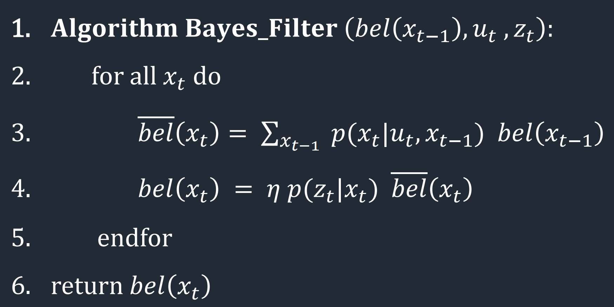
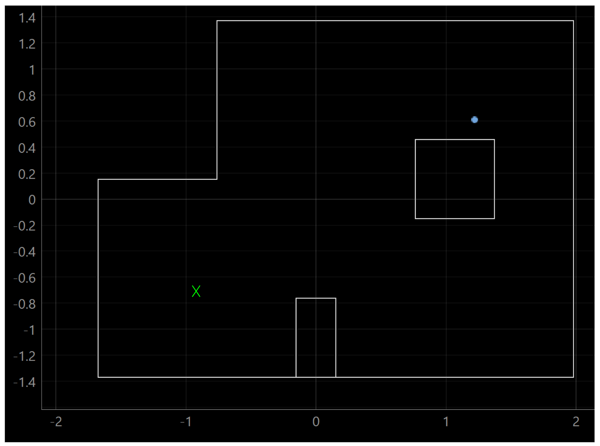
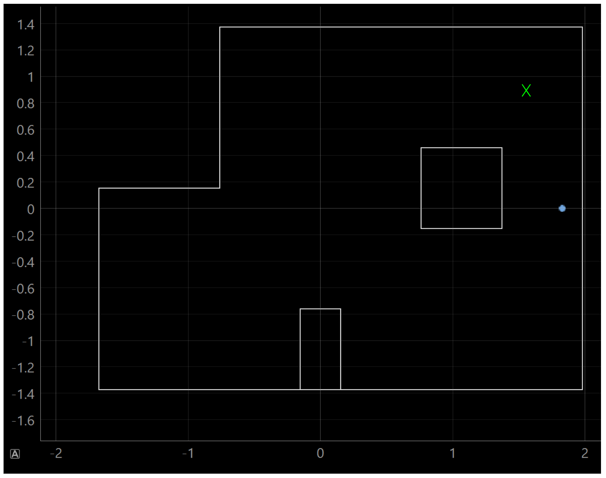
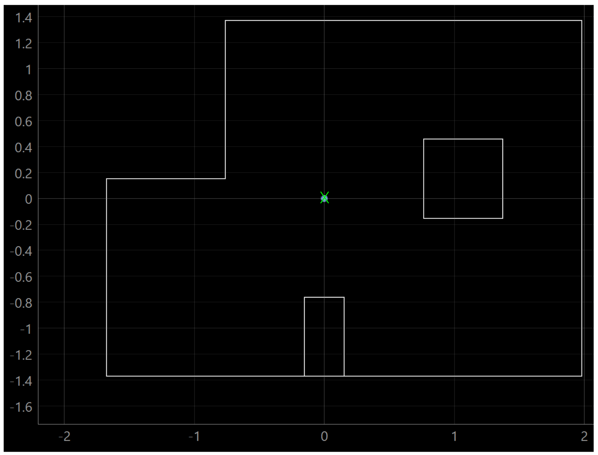
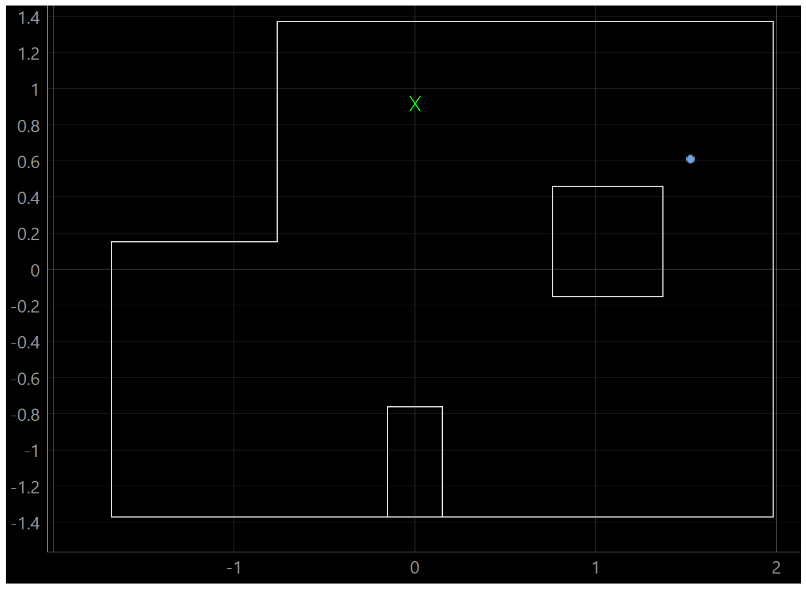

# Lab 11 Overview
In lab 11, principles developed in [lab 10](https://gabemitchell23.github.io/gfm48FastRobots/Lab10/lab10Writeup.html) were moved over from a simulator to the physical robot. Rather than spinning the robot in the simulator, the physical robot was spun in the lab arena while collecting ToF data. The data was then transferred to a laptop, where it was analyzed with a Bayes filter to update the belief in the robot's pose. 

## Bayes Filter
The Bayes Filter consists of two steps, the math for which is shown below. The 3rd row is the prediction step, which changes the belief in the robot's pose based upon the likely hood of arriving all cells from all previous cells times the likelyhood of the previous cells. The 4th row is the update step, which first analyzes the likelyhood of each cell based upon how actual sensor measurements compare with expected sensor measurements. The update step then updates the likelyhood of the cell based upon the likelyhood as given by both dynamics and sensors. This logic was explored in depth by students in lab 10. For lab 11, students were provided with optimized code that ran the bayes filter as fast as possible. 

## Data Collection
I was unable to collect data specifically for lab 11. Instead, I used existing data from [lab 9](https://gabemitchell23.github.io/gfm48FastRobots/Lab9/lab9Writeup.html), which was used to generate a map of the arena. Notably, the knowns and and unkowns swapped from lab 9 to lab 11. In lab 9, the robot's position with respect to a global reference frame was known, but the location of the map was not. In lab 11, the position of the map with respect to the global frame was known, but the robot's position was not. Despite the discrepancy, the data needed for both labs was identical: the robot rotating in place while collecting ToF measurements. A video of the robot collecting data for lab 9 is included below. The robot was controlled with a PD controller that rotated it in 20 degree increments between ToF readings. 

[Robot Collecting ToF Data](https://youtube.com/shorts/OlS8EkI7f7w?feature=share)

## Analysis
The robot collected ToF data at the following positions: (-3,-2), (0,0), (0,3), (5,-3), (5,3). After running the filter with data collected at these positions, the filter updated the belief in the pose as shown. The belief is the blue dot, and the truth pose is in green x. 

