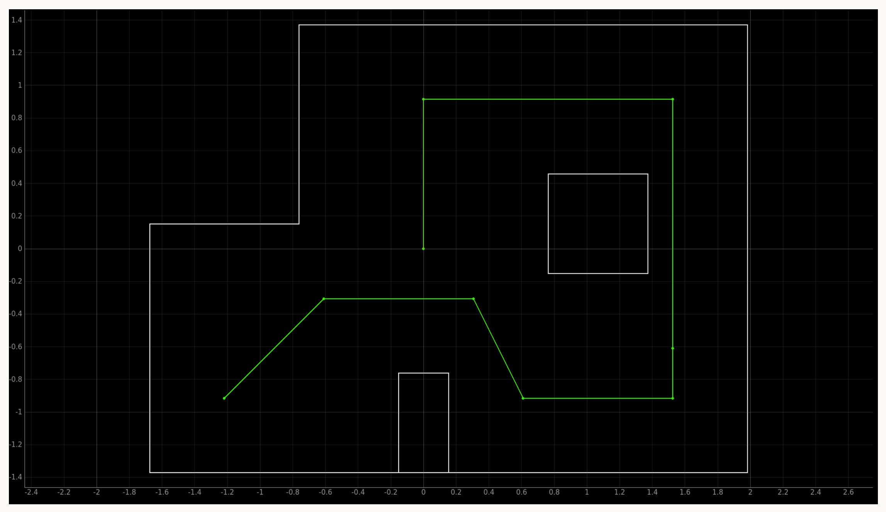

# Lab 12 Overview
In lab 12, students had their robot navigate to waypoints in a map with obstacles. The path that the robot was supposed to follow is pictured below. Students could have their robot follow the path in any way they saw fit. 

## Strategy
To follow the path, the robot either drove forward from one node to another, or it rotated toward the next node. When driving forward, the robot was controlled by a PD controller which ensured it stayed straight. The robot stopped driving forward when its depth sensor reached a specified value. When rotating, the robot rotated a specified amount while being controlled by a PD controller. The PD controller for driving straight and rotating a specified amount were developed during lab 8, and they are described in greater detail in the [lab 8 report](https://gabemitchell23.github.io/gfm48FastRobots/Lab8/lab8Writeup.html). For the code to run, I passed in a set of angles that the robot needed to rotate and a set of depths at which the robot began turns. 
