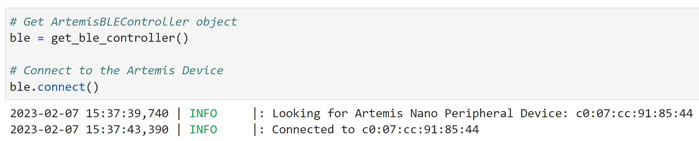

# Lab 2 Overview 
MAE 5190 Lab 1 introduced students to the Artemis Nano board. I ran exisiting example functions to complete simple tasks. I then wrote my own file to complete a task.

## Bluetooth Setup 
For my computer to communicate with the artemis nano via bluetooth, the nano's MAC address was printed by running ble_arduino.ino. 

The MAC address was then written into a python file that is queried when attempting to connect via bluetooth. Importantly, any single digit number between colons needs to be preceeded by a 0.

Python code was then run to generate a UUID, which was then input into arduino code running on the artemis and python code on my computer. A unique UUID distinguishes a particlar artemis nano, allowing my computer to connect to the corret board. 

Once both the UUID and MAC address were correctly defined, python bluetooth functions were imported and ran to establish bluetooth connection. Python generated outputs as shown.

   

## Demo
Python code was provided to students to verify bluetooth communication with the artemis. The code executed arduino functions on the artemis which then communicated back to my laptop. The first two functions queried the values of the characteristic string and characteristic float.

   

The next function redefined the value of the characteristic string to "PING". When the value of characteristic string was queired again, python showed that its value had changed. The message send off was confirmed in the Arduino serial monitor.

 

The last demo function sent two integers to the artemis, which were then printed into the serial monitor.

 

## Task 1: ECHO
The first task was to send the artemis a string using the command ECHO. The command sent the exact same string back to my laptop.

## Task 2: GET_TIME_MILLIS
The second task was creating a new function on the arduino which could be called by python on my laptop. The function quiered the artemis for the time (in ms) since the current arduino program started running. In the function, the time is converted to a string, and it is then written to the characteristic float using the same syntax as preexisting programs. On my laptop, python returned a string as shown. 

    

## Task 3: Notification Handler
A notification handler is triggered whenever the value of a variable is changed. Task 3 asked students to make a notifiation handler that triggers when the value of the characteristic string is changed. The code that I used to make the notification handler was an augmented version of that used by Robby Huang (website: https://lh479.github.io/ECE4960/). The handler is pictured below to the left. When running any other code that changes the charactertistic string, pythong displays as shown below to the right. 

