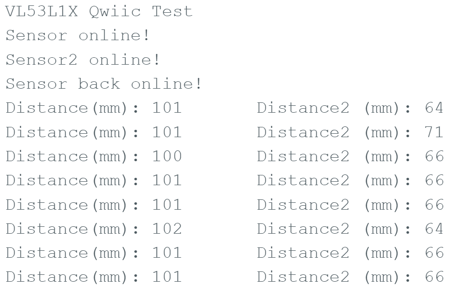

# Lab 3 Overview
During Lab 3, students worked with time of flight (ToF) sensors, which send out a signal and keep time until it returns after bouncing off an object. Based upon the speed of the signal (be it light or sound) the sensor can discern how far away the detected object is. Students began the lab by soldering the ToF sensors to QWIIC cables to facilitate communication with the artemis nano via I2C. Once wired, the artemis queried the ToF sensors for range data. Lastly, two ToF sensors were connected to the artemis, which required a specific setup to prevent confusion between the two sensors.

## Two sensor setup 
The default I2C address of the ToF sensor is 0x52. For this reason, when two are wired on the same I2C bus, there is no way to distinguish between them. One ToF sensor must be shut off while the other recieves commands to change its I2C address. I will place one ToF sensor on the front of the robot, and one ToF sensor on the right side. When turning left or backing up, the robot may not detect obstacles. If this setup becomes too problematic, sensors can be moved and wires can be resoldered. The schematic for two ToF sensors is pictured below. Along with QWIIC cables, there are two wires (green) going from GPIO pins on the artemis to the XSHUT pin on the ToF sensors. When the pins are set to low, the ToF sensors shut off. 

The physical system is pictured below. For any script where only one sensor is utilized, either of the two ToF sensors could be unplugged from the QWIIC multiport. 

## Single Sensor Connection

The example code Example1_ReadDistance will pause until the function distanceSensor.begin() returns true, meaning the artemis nano is communicating with the ToF sensor via I2C. If the sensor fails to connect, the code will output as shown below to the left. When the sensor does connect, the code will disply as shown below to the right. 

     

## Single Sensor Data

I analyzed sensor performance by taking depth measurements at offsets equal to 4", 8", 12", 16", and 20" in light and dark conditions. I used the default long range sensor setting, and I used the bluetooth communicaiton setup described in the bluetooth section below to transfer data from the artemis to my laptop. The results of the experiment are shown in the graph and table below.

  

For all sets of data, the average measurement varied from the offset by a 50 thousanths to a 300 thousanths of an inch. The sensor consistenly measured over the expected measurement, which I attribute to me pointint the sensor in a direction slightly off-normal form the detected surface. Given that the error was due to me pointing the sensor slightly  off, it is difficult to tell if performance in light or dark is better. However, the standard deviation in the measurments was consistently larger in the dark, so light measurements are more precise. For any one data set, the one second interval over which data was collected yielded 9 data points. The slow rate can be attributed to each data point being sent to the computer before the next one was taken.

## Double Sensor Data

The code to setup the I2C address change is pictured below to the right. The most important features are the delays before and after the Wire.begin() command. These give the sensor that was shut down time to initialize. The output of the two distinct sensors is shown below to the right. 

   

## Double Sensor Speed Analysis

Students were tasked with analyzing how quickly sensors generated readings. I wrote code (shown below) that rapidly wrote time values and waited for both sensors to have a reading. On average, there were about 0.1 seconds between instances when both sensors had readings. In this time frame, the loop ran about 35 times on average.

## ToF Sensor Data BlueTooth Transfer

I wrote code to transfer data from the artemis nano to my laptop. The code was the same format as ble_arduino.ino from lab 2. With in this infrastructure, I wrote the command pictured below. This command was used to transfer time of flight data from the artemis to my computer for the sensor performance analysis described above. 

The data is recieved on the computer via a notificaiton handler, and it is post processed with a little bit of python code. In the end, the data looks as shown, where the top vector is distance readings in inches, and the bottom vector contains arduino time stamps. 

## Discussion on Infrared Sensors
The two types of infrared sensors are active and passive. Active distance sensors emit IR radiation that is then reflected off surfaces and recieved by the sensor. Passive distance sensors emit no light and sense the light emitted naturally by the environment. Active IR sensors use more power, but passive IR sensors rely on obstables in the environment having IR signatures that are distinguishable from the surroundings. Among active IR distance sensors, there are those based on time of flight and those based on triangulation. Time of flight sensors measure distance based upon the time of traversal for signal of known speed. Triangulation sensor measure distance based upon the angle that a signal much leave the transmitter in order to be reflected towards the reciever. 
