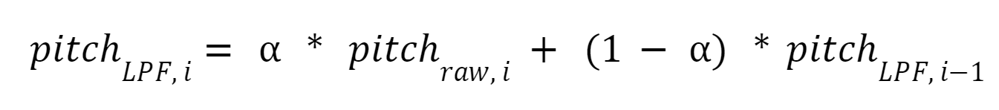
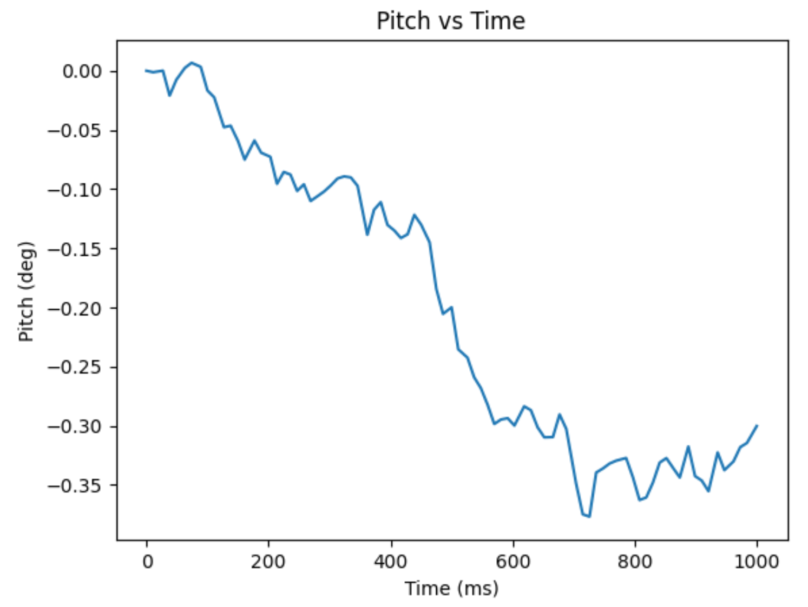

# Lab 4 Overview
During Lab 4, students worked with an inertial measurment unit (IMU) to calculate angular position. The gyroscope and accelerometer on the IMU were utilized. Then, students queried data from both the IMU and the ToF sensor from lab 3. The sensors as wired for the majority of the lab are pictured below.  

 

At the end of the lab, the electronics were removed from my laptop and plugged into a separate battery. The artemis, battery, and sensors were then fastened onto the RC car, where they querieid and transferred data as the car performed a stunt. The electronics on the car are pictured below. 

 

An accelerometer works by placing a capacitor plate on a spring. If the IMU accelerates in the direction of the spring, the force will move the capacitor plate, causing the capacitance to change. This change is quantifiable with additional circuitry and can be related to the acceleration. Gyroscopes detect the angular speed of the IMU. The reading can therefore be integrated to find the change in angular position with respect to a reference. The convention that this lab follows is as pictured below. The "forward" direciton of the vehcile and IMU is the positive x direction, the y direction points to the right, and z therefore must point down. The pitch, role, and yaw are as drawn. 

 

## Setup
First, students ran example code provided in the IMU library to verify functionality. The sample code successfully queried accelerometer, gyroscope magnetometer, and thermometer data, all of which are embedded in the IMU. The output of the example function is shown below. In the example code, there is a value AD0_VAL set to 1. This is the last bit of the IMU's I2C address. 

 

## Task Run speed
The code for all the accelerometer and gyrscope tasks below was written to run as fast as possible. Within the loops where the code queries the sensors, the code does nothing else, such as printing to the serial monitor or writing to the characteristic float (and therefore transmitting data via bluetooth). When the sensors return a value, the code stores it in a long arrary. Only after data is finished being retrieved from the sensors does data begin being transmitted via bluetooth. This coding method resulted in sampling at 350 Hz at the fastest. 

## Task 1: Accelerometer
Students were tasked with using the accelerometer to calculate the pitch and role of the IMU when the it was oriented at -90, 0, and 90 degrees. To convert the acceleration output to angular position values, the equations from lecture were used.

 

The 3 pitch graphs are pictured below. 

 

The 3 roll graphs are pictured below. 

 

All data sets were taken over a 1 second time span, and each contains about 300 data points. The sensor readings vary randomly about a constant average value. The precision is about ± 1 degree. The fourier decomposition of the angular position signals from the accelerometer is shown below. Very low frequencies are the most present. The cut off frequency for my low pass filter will therefore be 50Hz. 

 

The time constant of the low pass filter is therefore 

 

And the low pass filter constant is equal to (given than the period between measurments is roughly 1/300Hz)

 

The low pass filter can be applied to the accelerometer using the equation below. 

 

The low pass filter yielded the graph below to the left. Because the value of α that I calculated was relatively large compared to that used in class, I played around with different α values. I found that low values such as α=0.1 were the most precise, as shown in the graph below to the right. However, I was worried that low values would put too much weight on the previous reading and therefore misrepresent readings when the IMU is rotating rapidly. Accordingly, I settled on α=0.3 for the rest of the lab.

 

## Task 2: Gyroscope
Students were tasked with using the gyroscope to calculate the pitch, role, and yaw of the IMU at any position. Note that so long as the IMU sits still, its orientation will not change the reading of the gyroscope, as the gyroscope measures angular speed, not position. When the angular speed is integrated to find change in angular position, the change is with respect to an arbitrary reference.

 

The 3 angular position graphs are pictured below 

 

Again, data samples were taken over 1 second, and there are about 300 points per graph. The noise on the gyroscope graphs is much lower than the acceleration graphs. However, the gyroscope readings for pitch, roll, and yaw all drift with time. Decreasing the sampling rate (from 300 Hz to 100 Hz) did negate drift slightly, as shown in the plot below. In 1 second, the gyrscope pitch reading drifted to -0.35 deg instead of -0.5 deg. 

 

To really accentuate the benefits of both the gyroscopes and accelerometers on the IMU, a complimentary filter was implemented. The complimentary filter combines raw accelerometer readings with integrated gyroscope readings. The equations for pitch and roll as predicted by the complimentary filter are shown below.

 

The pitch and roll taken when the IMU is steady are shown in the graphs below. α=0.3 like before. 

 

Note the graphs do not drift, and they are precise to plus minus less than a degree. The Complimentary filter also performed well when the IMU was actually rotating, as shown in the graph below. 

 

## Task 3: ToF + IMU
The last task before placing electronics onto the car was integrating the IMU and the ToF sensor. Integrating the ToF sensor noticably slowed down the sampling rate, as data was only taken at time instances when both the IMU and ToF were ready to return a value. The frequency went down from 300 Hz with the IMU alone to about 10Hz when the ToF sensor was added. The data for the IMU and the ToF sensor over a 5 second period are shown in the graphs below. 
 

## Task 4: Integration onto Car
The electronics on the car are pictured again below. The ToF sensor was pointed forward so that it could sense obstacles in front of the car, and the IMU was placed such that it was flat. 

 

The video of the stunt is pasted below. The car approaches a wall and then spins. 

[Car Stunt](https://www.youtube.com/watch?v=Lc97Fxj513U)

The IMU and ToF sensor graphs are shown below. 

 

Note that the ToF data is as expected: it decreases up until the car reaches the wall, and then it jumps up when the car spins. The pitch data does not behave as expected: it should be constant for the entire stunt, as the car always stays flat on the ground. I attribute the error to the accelerometer picking up an acceleration as the car moves along the x-axis (forward). This error can be mitigated in future labs by decreasing the weight of the accelerometer term in the complimentary filter.
