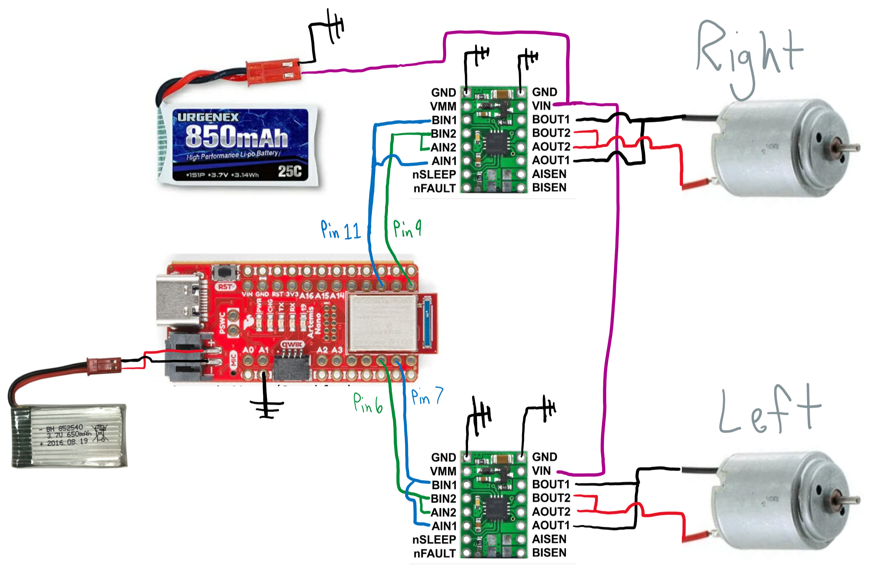

# Lab 5 Overview
During Lab 5, students used motor drivers to control motors on the car. The motor drivers received signals from the artemis, which determined which motors to power and what direction to spin. The motors were at first powered by a power supply to verify functionality. Afterwards, the motor drivers and all other electronics were integrated into the car, at which point the motor drivers were powered by a battery. After electronics integration, the motor duty cycles were augmented to drive the car in a straight line and drive the car as slowly as possible with the wheels still spinning constantly. 

## Prelab

Before the lab, students determined how they would integrate the motor drivers. My schematic is shown below. Note that the motors are receiving current from two output pins on the driver, allowing them to spin faster. Note also that there are two batteries, one for the motors, and one for the artemis. There are separate power sources because the artemis and the sensors plugged into it have much smaller power needs than the motors.

 

## Power Supply and Oscilloscope
To test the motor drivers, the motors were powered with a power supply, the artemis was powered from my laptop, and the signals from the artemis were displayed on an oscilloscope. A video of the entire set up,  a picture of the scope, and the code being run are shown below. The power supply was set to 4.2V, as that is the voltage of a fully charged single cell battery. The duty cycle was set to 50% using the arduino command "analogWrite()."

[Wheels Powered by Power Supply](https://youtu.be/qd_5-uTt7jk)

 

 

## Electronics Integration
After the functionality of the motor drivers was confirmed, all electronics were integrated into the car. Both the artemis and motor drivers are now being powered by batteries. All of the electronics are mounted using command strips. The front of the car is pictured on the left; the ToF sensors, IMU, and motor drivers are visible. The back of the car is pictured on the right; the artemis and batteries are visible. 

   

## Integration Testing
After integration, the functionality of the motors under battery power was verified. A video of all four wheels spinning under battery power is pasted below. 

[All Wheels Powered by Batteries](https://youtu.be/lvr_vKh-EBY)

## Lower PWM Limits
The lowest PWM signal that would start the robot from rest was 50 out of 255, or a 20% duty cycle. The exact value of this limit is surely subject to change depending on the charge of the motor battery or the surface beneath the wheels. A video of the robot being moved by a 20% duty cycle is shown below. Note that while the robot starts slow, it begins to speed up once the wheels are moving. This is because the motor torque needed to overcome the inertia of the wheels at rest is greater than that needed to maintain the wheels in motion. 

[Lowest PWM to Start Rotation](https://youtu.be/YScqIbheEow)

The lowest PWM signal to keep the wheels in motion was also found. In the video below, the robot started to move with a duty cycle of 60/255, but (at the 5 second mark) it switched to a duty cycle of 47/255. Any duty cycle below this would have caused the wheels to stall. 

[Lowest PWM to Continue Rotation](https://youtu.be/pb3lOt78wqM)

The analogWrite command being used to send PWM signals to the motors has a frequency of 500 Hz. The time scale of the motors changing speeds is orders of magnitude larger than the time that the PWM signal switches its value, so 500 Hz is fast enough. Manually generating a faster PWM signal may actually lead to decreased performance. The oscilloscope reading from above (pictured again immediately below) shows that when the PWM signal transitions from high to low, the change is not immediate. So, if the duty cycle were faster, the PWM signal may spend even less time at a true low setting than it already does. Instead, the entire time that is supposed to be low, it will spend at some unknown transition voltage, which will lead to unpredictable motor performance.    

 

## Open Loop Control
To get the car to run in a straight line, the duty cycles of the two motors had to be vastly different. A video of both motors with a duty cycle of 85/255 is shown below. The left wheels clearly turn much faster. 

[Lowest PWM to Start Rotation](https://youtube.com/shorts/7vyXD9wspjM)

The most successful PWM set was 65 on the left wheels and 120 on the right wheels. The car following the line is shown in the video below. No matter what values the motors were given, performance was very inconsistent. 

[Lowest PWM to Continue Rotation](https://www.youtube.com/shorts/lXu3Le6Uhno)

