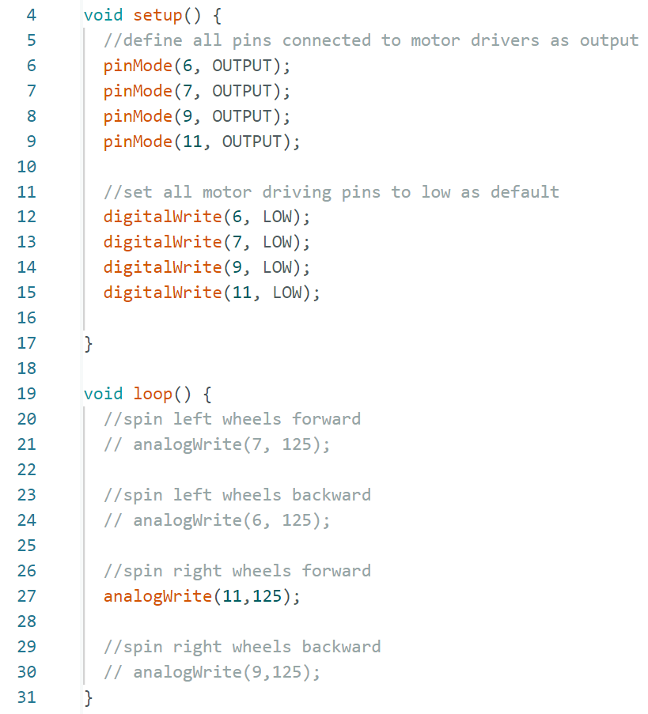

# Lab 5 Overview
During Lab 5, students used motor drivers to control motors on the car. The motor drivers recieved signals from the artemis, which determined which motors to power and what direction to spin. The motors were at first powered by a power supply to verify functionality. Afterwards, the motor drivers and all other electronics were integrated into the car, at which point the motor drivers were powered by a battery. After electronics integration, the motor duty cycles were augmented to drive the car in a straight line and drive the car as slowly as possible with the wheels still spinning consitently. 

## Prelab

Before the lab, students determined how they would integrate the motor drivers. My schemetic is shown below. Note that the motors are recieving current from two output pins on the driver, allowing them to spin faster. Note also that there are two batteries, one for the motors, and one for the artemis. There are separate power sources because the artemis and the sensors plugged into it have much smaller power needs than the motors.

 

## Power Supply and Osciliscope
To test the motor drivers, the motors were powered with a power supply, the artemis was powered from my laptop, and the signals from the artemis were displayed on an oscilliscope. A video of the entire set up,  a picture of the scope, and the code being run are shown below. The power supply was set to 4.2V, as that is the voltage of a fully charged single cell battery. The duty cycle was set to 50% using the arduino command "analogWrite()."

[Wheels Powered by Power Supply](https://youtu.be/qd_5-uTt7jk)

 

 

## Electronics Integration
After the functionality of the motor drivers was confirmed, all electronics were integrated into the car. Both the artemis and motor drivers are now being powered by batteries. All of the electronics are mounted using command strips. The front of the car is pictured on the left; the ToF sensors, IMU, and motor drivers are visible. The back of the car is pictured on the right; the artemis and batteries are visible. 

   

## Integration Testing
After integration, the functionality of the motors under battery power was verified. A video of all four wheels spinning under battery power is pasted below. 

[All Wheels Powered by Batteries](https://youtu.be/lvr_vKh-EBY)
