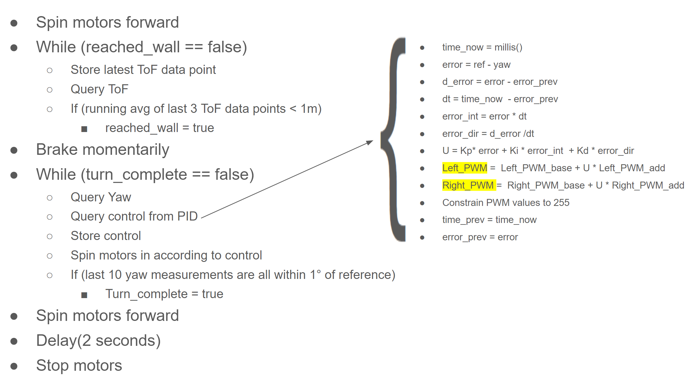
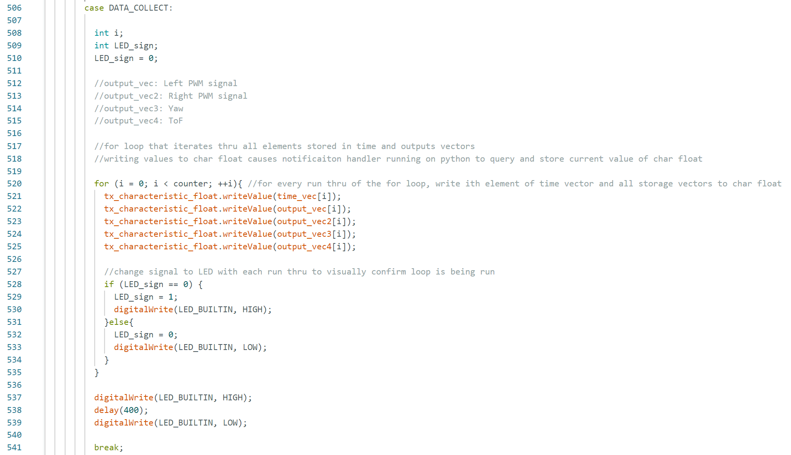

# UNFINISHED, USING SLIP DAYS

# Lab 6 Overview
In Lab 6, students had the option to implement PID control to aid the robot complete one of two tasks: either approaching and stopping exactly 1m in front of a wall, or rapidly approaching a wall, spinning exactly 180 degrees, and then driving away from the wall in the opposite direction. I chose the latter task. I started by developing the code infrastructure by running it with a simple set of parameters: slow speeds and only P control. P control was not satisfactory on its own; after I tailored parameters as best as I could, I added integral and dirivative terms, which made the robot turn closer to 180 degrees in less time. 

## Code Overview 
The code for my 180 degree turn has two primary functions: an actuation and data collection function, and then a data transmission function. Psuedo code for the actuation and collection function is shown below. Note that during rotation, the PWM signals sent to the motors are not directly proportional to the control. Rather, there is a base PWM value that the motors will recieve even if the control U is zero. This is because the PWM value at which the motors won't spin isn't actually zero. 

 

The actual code for the collection function is shown below. The time, left PWM signal, right PWM signal, yaw, and ToF data were collected using the previous function, and they were sent to my computer using this function. Note that this function was only run after all actuation and data collection was complete to keep computation as fast as possible. Data transmission occured because a notificaiton runner was running on my laptop, which queried and stored the value of the characteristic string each time it was changed by the collection function. 

 

## P Control Issues
One issue I had with code was getting the robot to simply drive in a straight line. The left and right PWM values which caused the robot to drive in a straight line were not only very different, but they varied from one run to another. Another issue was the robot drifting into the wall even after starting its turn at one meter. This often caused the robot's wheels to get caught up and fail to rotate the robot to the reference (an integrator term would have fixed this problem). A video of the robot veering off course and then getting caught up in the wall is linked below. 

[https://youtube.com/shorts/ipwTtwpGaeE](https://youtube.com/shorts/AHA0-MF2qxQ?feature=share)

## P Control Most Successful Run

The most successful P control run is shown below. In this run, the duty cycles for the motors when driving forward in a straight line were 33.33% for the left motor and 60% for the right motor. The proportional gain was 0.27. Lastly, the base analog write value for the left and right motors were 100 and 120 respectively. The additional analog write value that was multiplied by the control and added to the base was 110 and 120 for the left and right motor respectively. The video linked below shows the run - note that the robot rotated more than 180 degrees. 

https://www.youtube.com/shorts/ipwTtwpGaeE

## PID Control
