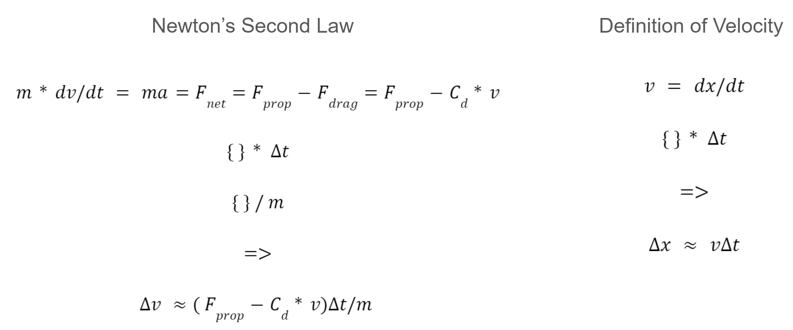
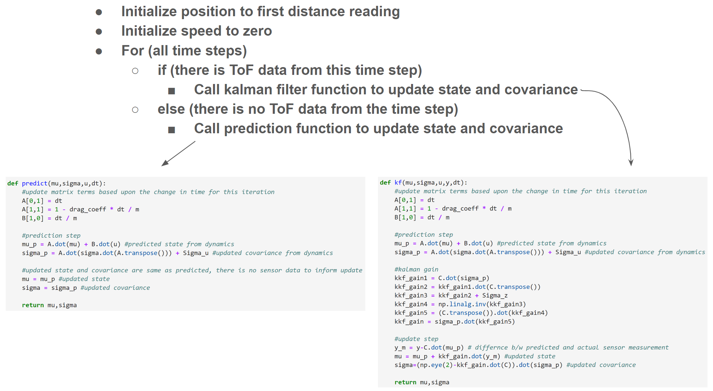

# Lab 7 Late Submission Date
I submitted lab 7 before 8am on 4/5. I therefore used 7 slip days. On canvas, I specified that I would only use 2 slip days.

# Lab 7 Overview
In Lab 7, students wrote a kalman filter to estimate the state of the robot as it drives towards the wall before it executes a stunt. The new state was predicted using the duty cycle of the PWM signals sent to the wheels, and the new state was updated using ToF sensor data. The kalman filter gives a more accurate esimatation of the robot's distance from the wall, because it fuses multiple sources of information. Students then implmented dead reckoning (only accounting for the duty cycle of PWM signals) to estimate the state of the robot between sensor readings. In Lab 8, students will use the kalman filter and extrapolation via dead reckoning to have the robot begin its stunt immediately after reaching 1 meter away from the wall.

## Methodology
The kalman filter was designed based based upon ToF sensor data collected as the robot sped toward a wall. The data was analyzed to discern system constants, which inform the prediction step of the Kalman filter. After the filter was designed, it's state prediction was compared to the raw sensor data for additional parameter tuning.  

## Parameter Estimation - Physical Constants
The robot's state was described with two terms, the position, x, and velocity, v. The physcis that governthe robot's state are described in the equations below; when manipulated, the equations estimate the changes in the robot's state. C_d is the drag coefficient, and F_prop is the propulsive force from the wheels moving the robot forward.

 

When massed, the robot was 0.553 kg. The propulsive force was estimated to be 1N. The last unknown is the drag coefficent, which was optimized after the kalman filter was designed and compared to raw sensor data. 

## Parameter Estimation - Noise
The noise in the distance sensor was modeled as a guassian with zero mean and a standard deviation of 0.1m. This was based upon observed values during previous ToF sensor labs. In the dynamics model, the proccess noise for the position and velocity estimation were modeled as guassians with zero mean and standard devitions of 1m and 1m/s respectively. The process noise was made 1 order of magnitude larger than the sensor noise so the the kalman filter would heavily weight the sensor information. 

## Matrices 
Based upon the equations and constants described above, the matrices in the kalman filter took the following values

## Data Collection
A video of the robot speeding towards the wall as data was collected is included below. The robot slightly moves back and forth because I implemented a controller to keep the robot moving straight. In past labs, the robot continuously veered left or right.

## Kalman Filter Design
A combination of code and psuedo code is picutred in the diagram below to communicate how I implemented designed the kalman filter. The code as 

 
