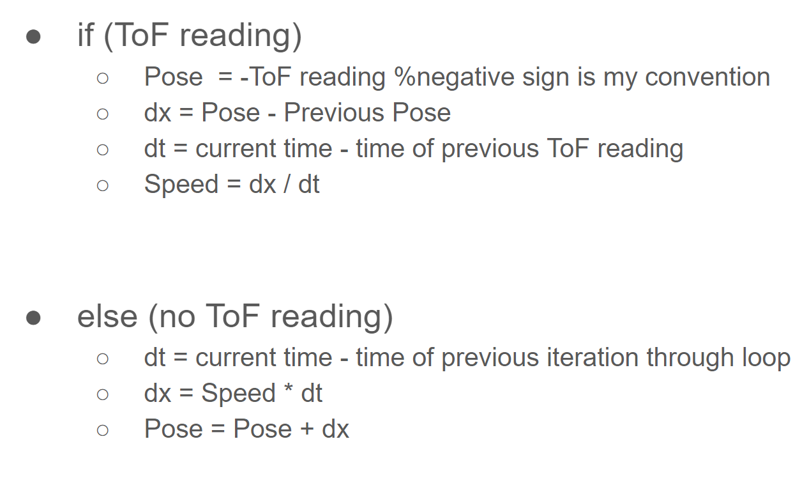

# Lab 8 Coolest Video Submission
After completing Lab 8, I taped my phone to my robot, as shown in the photos below. 

  

This allowed me to record a first person view of the robot as it completed its stunt. This video is linked below.

[Coolest Stunt Video, Robot POV](https://youtu.be/qYq4uiy29VA)

# Lab 8 Late Submission Date
I submitted lab 8 before 8am on 4/17. I therefore used 5 slip days.

# Lab 8 Overview
In lab 8 students built upon progress made in [lab 6](Lab6/lab8Writeup.html) and [lab 7](Lab7/lab8Writeup.html). The goal is to complete the stunt in as little time as possible. The state estimation from lab 7 helped the robot recognize when it 1 meter away from the wall as quickly as possible. Additionally, implementing a stunt for the first time in lab 6 allowed students to learn from mistakes and improve upon their stunt

## Changes since Lab 6 - Taped Wheels
One problem I had in lab 6 was very erratic behavior when the robot turned. Another issue was the right set of wheels not being able to turn unless being given a very very high duty cycle. Adding tape to the wheels solved both problems. The taped wheels reduced friction with the ground. This reduced the force that worked against the robot when rotating about its vertical axis. The friction-reducing tape also reduced torque that each wheel needed to begin rotation. The Robot with its newly taped wheels is pictured below. 

 

## Changes since Lab 6 - State Estimation
My code did not use the kalman filter designed in lab 7 to update my belief in the robot's pose. Rather, I used simple extrapolation which was intermittently corrected by a ToF reading. The ToF readings were treated as the ground truth, so when there was a ToF reading, the state estimator placed the robot at the exact pose specified by the sensor reading. Extrapolation was done by assuming the current speed of the robot was the average speed between the two most recent ToF sensor measurements. This quantity multiplied by the change in time since the most recent ToF reading extrapolated the robot's pose. This simple state estimator was used in place of the kalman filter because it was much easier to implement, and it did not comprimise performance. A diagram of the new, simple state estimator is shown below. 

 

## Changes since Lab 6 - Closed Loop Control when Driving Forward.
One challenge I had in lab 6 was making the robot drive in a straight line. This is becasue my right motor requires a much larger duty cycle to spin than my left motor. In lab 6, each motor had one constant duty cycle until the robot reached the wall and began its turn. In lab 8, I impletmented a PD controller with Kp = 1 and Kd = 0.3 to control the yaw of the robot as it drove towards the wall. The affects of this controller are discussed in the plots and videos below. 

# Lab 8 Stunt
The code from lab 6 along with the changes described above resulted in the robot performing as shown in the video. The time between the robot crossing the line at the beginning and end of the stunt is ~ 6 seconds. Note that both times the robot began to drive forward, it moved off of yaw = 0° very quickly. However, this offset was slowly corrected by the controller.  

[Turning Stunt](https://youtube.com/shorts/O7jtek9dTOw?feature=share)

## Lab 8 Data
While performing the stunt, the data the robot collected was ToF measurements, motor duty cycles, and yaw. The data is grouped by what stage of the stunt the robot was on. Graphs of each data set at each point in the stunt are included below. 

## Pose Belief Data
The most notable graph is the overlay of the robot's pose belief and the ToF sensor readings. For almost all instances where there was a ToF reading, the previous prediction via extrapolation was spot on. Additionally, the robot entered the turn portion of the stunt when its pose belief was extrapoled to very nearly 1m away from the wall. The robot did not need a TOF sensor measurement to continue with its stunt. 

 

## Yaw and Duty Cycle Data

 
 
 
 
