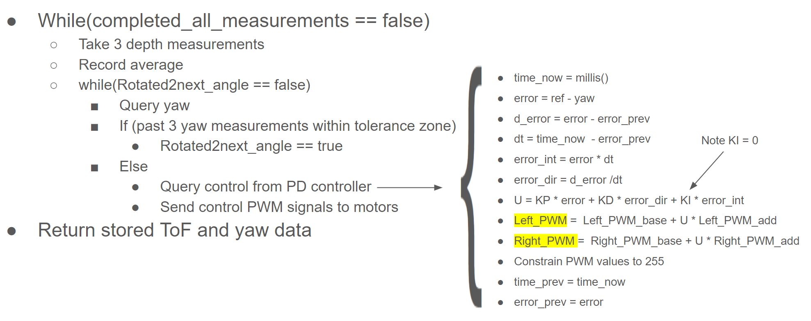

# Lab 9 Overview
In lab 9, students wrote code which mapped an arena in the lab. The code took ToF measurments inbetween in-place rotations that spanned 360 degrees. The robot executed the code at 5 spots throughout the map. By converting the position of the percieved obstacle in the robot's frame to the global frame, a map of the arena was developed.

## Code overview
Psuedo code for my mapping function is shown below. My code used a PD controller to change its orientation based upon feedback from the onboard ToF sensor. Once at a measurement location, 3 ToF sensor measurements were taken and averaged. ToF values were stored and returned to the robot via a notifcation handler. 

The PD controller for yaw was borrowed from labs 6 and 8. As the robot rotates towards its target angular position, the duty cycle sent to the motors vary as seen in the graph below from lab 6.

## Executing Code
The video below shows the robot executing the code, rotating to specified positions, and taking ToF measurments. Note that the robot moved off of its starting point, which was a recurring issue while I conducted this lab. 

## Data 
In the polar coordinate plots below, the ToF data is shown centered at the five points that the robot rotated about. 

## Post Processing and Analysis
To convert the data from the robot frame to the global frame, transformtion matrices were used. A transformation matrix is an encoding of a rotation and translation that differentiate the point of view of one coordinate system and another. In two dimensions, a transformation matrix has the form shown below. The notation BI stands for body to inertial, so R_BI is the rotation matrix to go from the body fixed from to the inertial frame, if the two coordinate systems shared the same origin. The pos is the x,y coordinate of the robot in inertial/global frame. Multiplying a point in the body frame by the transformation matrix BI will return the coordinates of the point in the inertial frame. 

When the data from all ther different rotation locations is overlayed, the following plot results. 

